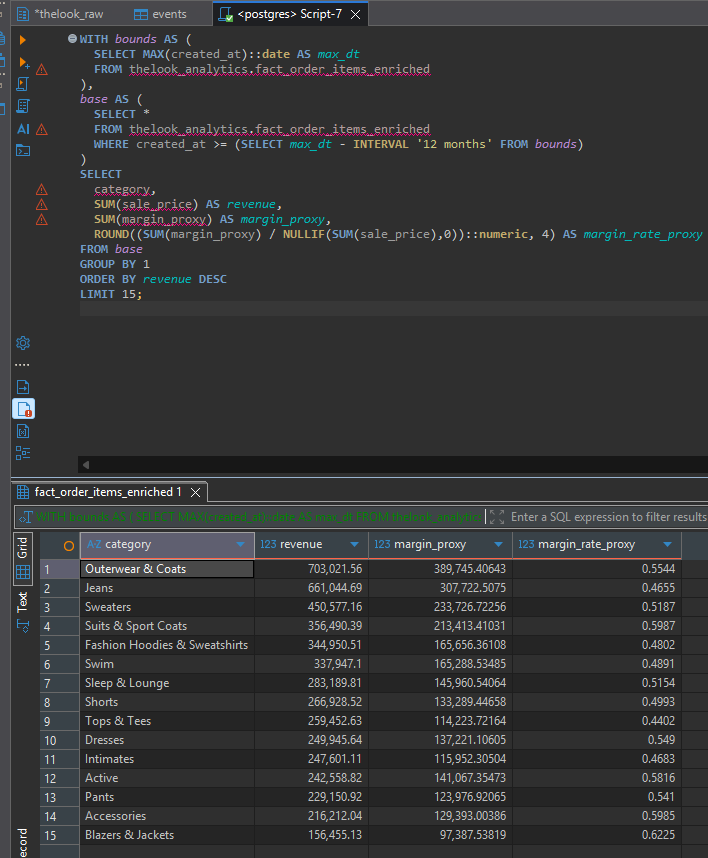
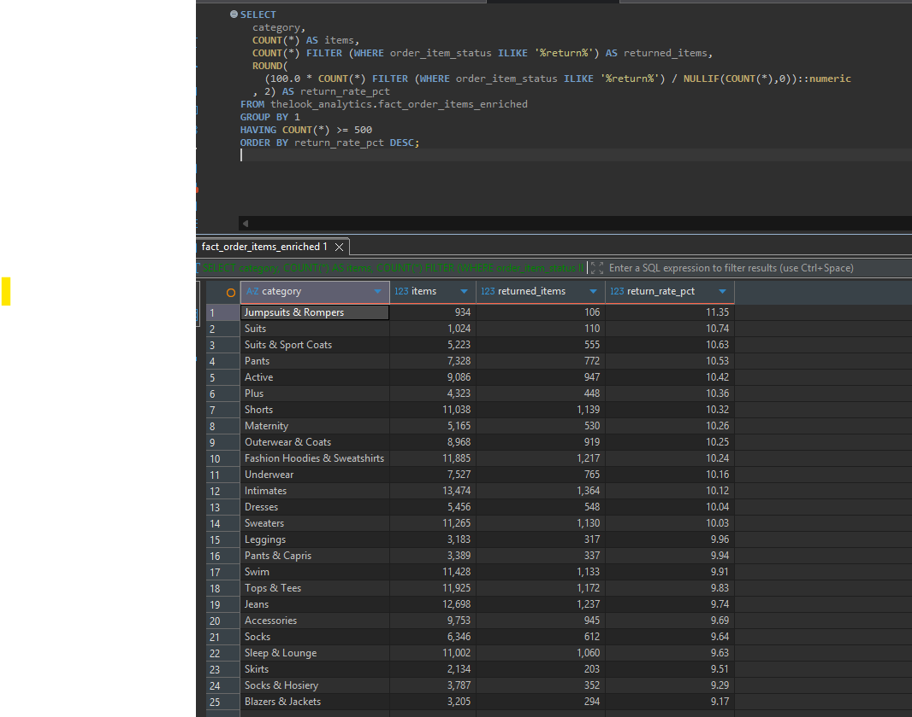
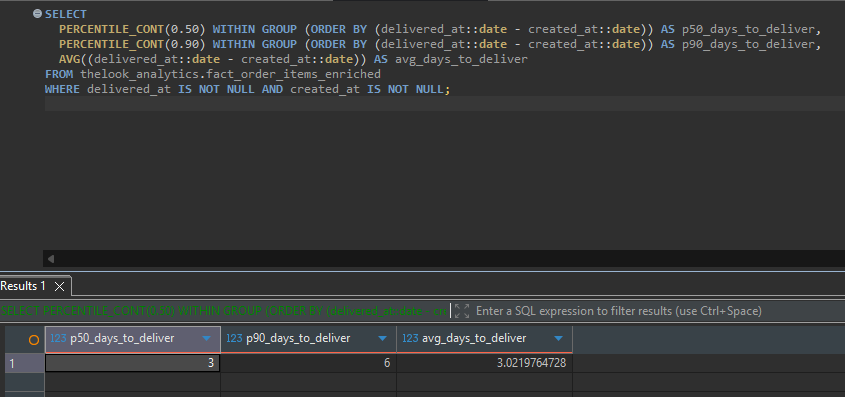
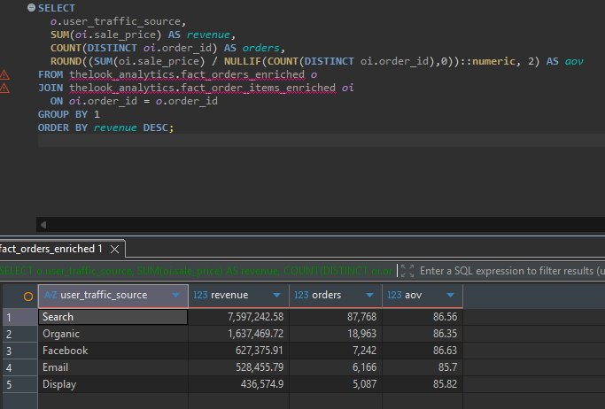

Data window: 2019-01-06 → 2024-01-21

Top revenue categories:

Query used

WITH bounds AS (
  SELECT MAX(created_at)::date AS max_dt
  FROM thelook_analytics.fact_order_items_enriched
),
base AS (
  SELECT *
  FROM thelook_analytics.fact_order_items_enriched
  WHERE created_at >= (SELECT max_dt - INTERVAL '12 months' FROM bounds)
)
SELECT
  category,
  SUM(sale_price) AS revenue,
  SUM(margin_proxy) AS margin_proxy,
  ROUND((SUM(margin_proxy) / NULLIF(SUM(sale_price),0))::numeric, 4) AS margin_rate_proxy
FROM base
GROUP BY 1
ORDER BY revenue DESC
LIMIT 15;

Return risk:

SELECT
  category,
  COUNT(*) AS items,
  COUNT(*) FILTER (WHERE order_item_status ILIKE '%return%') AS returned_items,
  ROUND(
    (100.0 * COUNT(*) FILTER (WHERE order_item_status ILIKE '%return%') / NULLIF(COUNT(*),0))::numeric
  , 2) AS return_rate_pct
FROM thelook_analytics.fact_order_items_enriched
GROUP BY 1
HAVING COUNT(*) >= 500
ORDER BY return_rate_pct DESC;

Fulfillment SLA: p50/p90/avg days

SELECT
  PERCENTILE_CONT(0.50) WITHIN GROUP (ORDER BY (delivered_at::date - created_at::date)) AS p50_days_to_deliver,
  PERCENTILE_CONT(0.90) WITHIN GROUP (ORDER BY (delivered_at::date - created_at::date)) AS p90_days_to_deliver,
  AVG((delivered_at::date - created_at::date)) AS avg_days_to_deliver
FROM thelook_analytics.fact_order_items_enriched
WHERE delivered_at IS NOT NULL AND created_at IS NOT NULL;

Traffic source performance: revenue/orders/AOV by traffic source

DROP VIEW IF EXISTS thelook_analytics.fact_orders_enriched;

CREATE VIEW thelook_analytics.fact_orders_enriched AS
SELECT
  o.order_id,
  o.user_id,
  o.status AS order_status,
  NULLIF(o.created_at,'')::timestamptz AS created_at,
  NULLIF(o.shipped_at,'')::timestamptz AS shipped_at,
  NULLIF(o.delivered_at,'')::timestamptz AS delivered_at,
  NULLIF(o.returned_at,'')::timestamptz AS returned_at,
  o.num_of_item,
  u.country,
  u.state,
  u.city,
  u.traffic_source AS user_traffic_source
FROM thelook_raw.orders o
LEFT JOIN thelook_raw.users u ON u.id = o.user_id;

Query

SELECT
  o.user_traffic_source,
  SUM(oi.sale_price) AS revenue,
  COUNT(DISTINCT oi.order_id) AS orders,
  ROUND((SUM(oi.sale_price) / NULLIF(COUNT(DISTINCT oi.order_id),0))::numeric, 2) AS aov
FROM thelook_analytics.fact_orders_enriched o
JOIN thelook_analytics.fact_order_items_enriched oi
  ON oi.order_id = o.order_id
GROUP BY 1
ORDER BY revenue DESC;

Retention baseline: cohort repeat_rate_pct trend

WITH first_order AS (
  SELECT
    user_id,
    MIN(NULLIF(created_at,'')::timestamptz)::date AS first_order_date
  FROM thelook_raw.orders
  GROUP BY 1
),
orders_per_user AS (
  SELECT user_id, COUNT(*) AS orders
  FROM thelook_raw.orders
  GROUP BY 1
)
SELECT
  DATE_TRUNC('month', f.first_order_date)::date AS cohort_month,
  COUNT(*) AS new_customers,
  COUNT(*) FILTER (WHERE o.orders >= 2) AS repeat_customers,
  ROUND((100.0 * COUNT(*) FILTER (WHERE o.orders >= 2) / NULLIF(COUNT(*),0))::numeric, 2) AS repeat_rate_pct
FROM first_order f
JOIN orders_per_user o USING (user_id)
GROUP BY 1
ORDER BY cohort_month;
